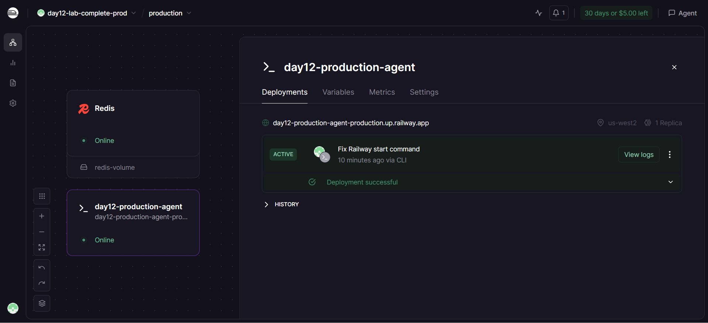
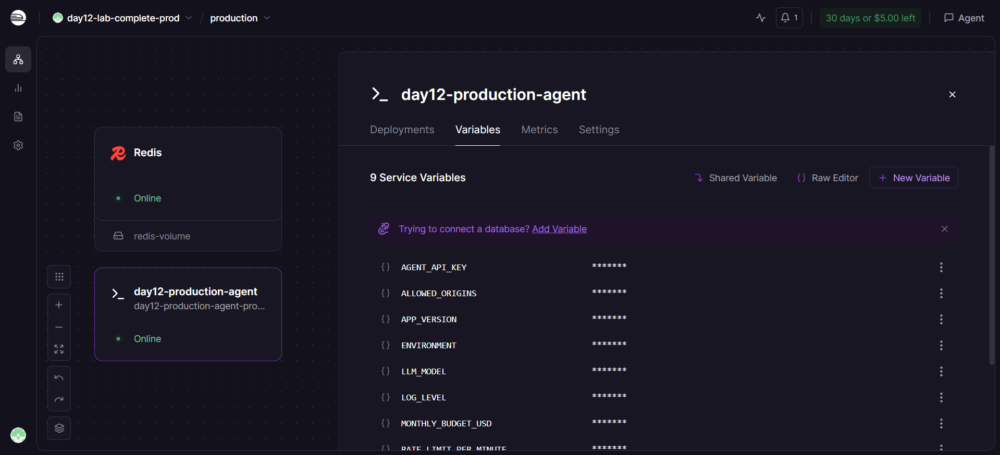

# Deployment Notes

## Platform

- Platform: Railway
- Project: `day12-lab-complete-prod`
- Service: `day12-production-agent`
- Managed Redis service: `Redis`
- Public URL: `https://day12-production-agent-production.up.railway.app`
- Deployment date: `2026-04-17`

## Environment variables configured

These variables were set on the Railway app service:

- `ENVIRONMENT=production`
- `LOG_LEVEL=INFO`
- `APP_VERSION=2.0.0`
- `LLM_MODEL=mock-gpt-4o-mini`
- `RATE_LIMIT_PER_MINUTE=10`
- `MONTHLY_BUDGET_USD=10.0`
- `ALLOWED_ORIGINS=*`
- `AGENT_API_KEY=<configured in Railway, not committed>`
- `REDIS_URL=<mapped from Railway Redis service>`

Railway deployment status:



Railway service variables:



## Local verification completed

- `python check_production_ready.py` -> `20/20 checks passed`
- Docker image size: 246.71 MB
- Local stack: `agent + redis + nginx`
- Local endpoints verified:
  - `GET /health` -> `200`
  - `GET /ready` -> `200`
  - `POST /ask` without API key -> `401`
  - `POST /ask` with API key -> `200`
  - request 11 within one minute for the same `user_id` -> `429`
  - seeded budget exhaustion in Redis -> `402`

## Public smoke tests

Verified against the Railway URL:

- `GET /health` -> `200`
- `POST /ask` without API key -> `401`
- `POST /ask` with API key -> `200`

Sample request used:

```bash
curl https://day12-production-agent-production.up.railway.app/health

curl -X POST https://day12-production-agent-production.up.railway.app/ask \
  -H "Content-Type: application/json" \
  -H "X-API-Key: <redacted>" \
  -d '{"user_id":"railway-user","question":"What is deployment?"}'
```

## Screenshot references

- Root endpoint response: [day12-railway-root.png](screenshots/day12-railway-root.png)
- Health endpoint response: [day12-railway-health.png](screenshots/day12-railway-health.png)
- Test evidence summary: [day12-smoke-tests.md](screenshots/day12-smoke-tests.md)
